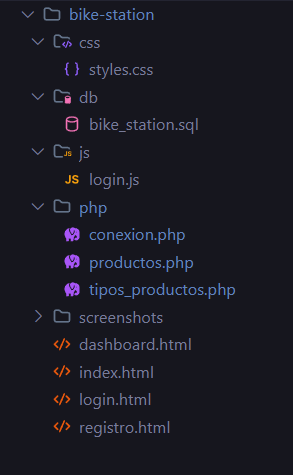

### Bike Station - Sistema de Venta de Bicicletas

- Sistema web completo para la gestión de productos y tipos de bicicletas, desarrollado con HTML, CSS, JavaScript, PHP y MySQL.

   

##Descripcion

- Bike Station es una pagina web que permite gestionar un catálogo de bicicletas y sus tipos. Incluye un dashboard administrativo completo con operaciones CRUD (Crear, Leer, Actualizar, Eliminar) para productos y categorías.

###Caracateristicas
---
- Página de inicio
- Sistema de login y registro (validación frontend)
- Dashboard administrativo completo
- Gestión de productos 
- Gestión de tipos de productos 
- Interfaz moderna con Bootstrap 5
- Diseño responsive para móviles y tablets
- Operaciones en tiempo real sin recargar página

####🛠️ Tecnologías Utilizadas
####Frontend

- HTML5
- CSS3 (con diseño personalizado)
- JavaScript (Vanilla JS)
- Bootstrap 5.3.0

####Backend

- PHP 8.2
- MySQL 8.0
- Apache (XAMPP)

###Requisitos Previos
- XAMPP 
- Apache
- MySQL
- PHP 8.0+

Navegador web moderno (Chrome, Firefox, Edge)
Editor de código (VS Code, Sublime Text, etc.)

###📁 Estructura del Proyecto

###Uso del Sistema
1.  Página Principal

- Muestra información general sobre Bike Station
- Acceso a login y registro

2. Login

- Valida formato de email
- Valida longitud de contraseña (mínimo 6 caracteres)
- Redirige al dashboard

3. Registro

- Formulario completo
- Campos: nombre, email, teléfono, dirección, ciudad, contraseña
- Validación de términos y condiciones

4. Dashboard

	Gestión de Tipos de Productos
- Crear: Clic en "+ Nuevo Tipo"
- Editar: Clic en el botón "Editar" de cualquier tipo
- Eliminar: Clic en el botón "Eliminar" (con confirmación)

	Gestión de Productos

- Crear: Clic en "+ Nuevo Producto"
- Editar: Clic en el botón "Editar" de cualquier producto
- Eliminar: Clic en el botón "Eliminar" (con confirmación)
- Los productos se relacionan automáticamente con sus tipos

👥 Autores

Diego Torres - Desarrollador -diego7trp

📞 Contacto

Email: diego2006cy@gmail.com
GitHub: diego7trp
